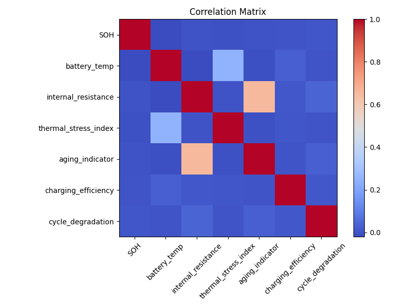
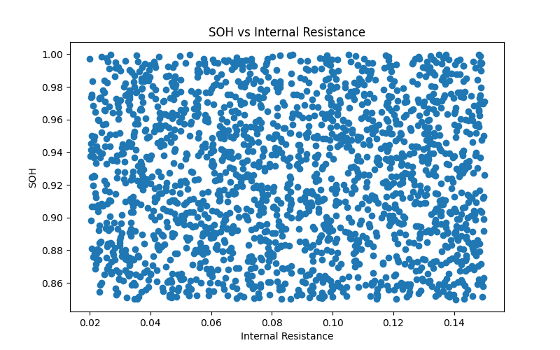
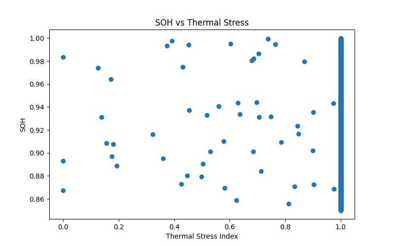

# Battery Diagnostics and Degradation Driver Analysis

## Project Overview

This project investigates the relationship between battery health and key operational parameters to identify potential degradation drivers and support battery diagnostic decision-making.

Using battery charging data, the analysis explores how factors such as internal resistance, thermal stress, charging efficiency, and aging indicators are associated with battery State of Health (SOH). The goal is to determine which variables are most strongly linked to battery degradation and can serve as useful diagnostic indicators.

---

## Objectives

* Perform battery data quality assessment.
* Analyze battery health and degradation trends.
* Investigate relationships between SOH and operational parameters.
* Identify key degradation drivers through correlation analysis.
* Classify batteries based on health condition.
* Generate fleet-level battery health insights.

---

## Dataset Features

The dataset contains battery charging and health-related parameters, including:

* State of Health (SOH)
* State of Charge (SOC)
* Battery Temperature
* Ambient Temperature
* Internal Resistance
* Charging Efficiency
* Thermal Stress Index
* Aging Indicator
* Cycle Degradation
* Battery Current
* Terminal Voltage

---

## Methodology

### 1. Data Quality Assessment

* Dataset inspection
* Missing value analysis
* Duplicate record detection
* Statistical summary generation

### 2. Exploratory Data Analysis

Visualizations were created to investigate:

* SOH distribution
* SOH vs Battery Temperature
* SOH vs Internal Resistance
* SOH vs Charging Efficiency
* SOH vs Thermal Stress Index

### 3. Correlation Analysis

A correlation matrix was generated to evaluate relationships between battery health and operational variables.

### 4. Degradation Driver Identification

Variables were ranked according to their correlation with SOH to identify the most significant degradation indicators.

### 5. Battery Health Classification

Batteries were classified into:

* Healthy (SOH ≥ 90%)
* Monitor (80% ≤ SOH < 90%)
* Inspect (SOH < 80%)

### 6. Fleet Health Assessment

Fleet-level statistics were generated to evaluate overall battery condition and health distribution.

---

## Key Results

The analysis identified several operational variables strongly associated with battery health decline.

Key diagnostic indicators include:

* Internal Resistance
* Thermal Stress Index
* Aging Indicator
* Charging Efficiency

These parameters provide valuable insights into battery degradation behaviour and can support battery condition monitoring and predictive maintenance strategies.

---

## Project Outputs

* Data Quality Assessment
* SOH Distribution Analysis
* Diagnostic Scatter Plot Visualizations
* Correlation Matrix Heatmap
* Degradation Driver Identification
* Battery Health Classification
* Fleet Health Summary

---

## Key Visualizations

### Correlation Matrix

### SOH vs Internal Resistance

### SOH vs Thermal Stress

### SOH Distribution

---

## Technologies Used

* Python
* Pandas
* NumPy
* Matplotlib

---

## Skills Demonstrated

* Battery Diagnostics
* Battery Health Assessment
* Battery Aging Analysis
* Correlation Analysis
* Data Visualization
* Battery Performance Monitoring
* Fleet Health Analytics
* Predictive Maintenance Support

---

## Future Improvements

Potential future enhancements include:

* Advanced battery health scoring
* Machine learning-based diagnostic models
* Time-series degradation analysis
* Remaining Useful Life (RUL) estimation
* Automated maintenance recommendation systems
